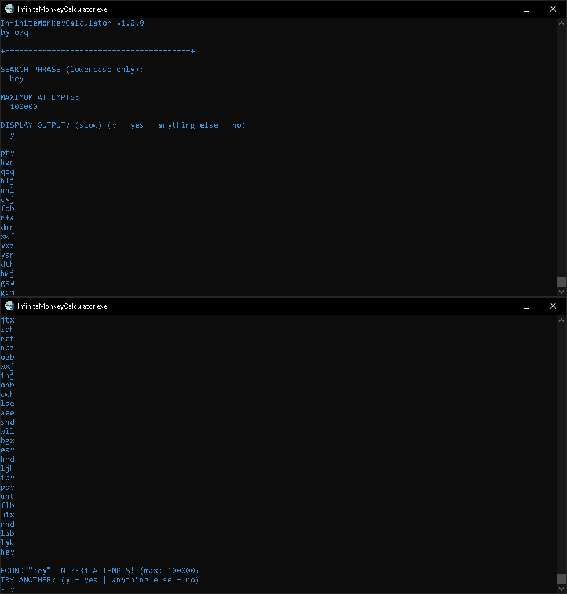

# This repository is no longer maintained.
This was one of my C++ applications I made in order to learn C++. I never plan to update it.

###### Chimpanzee probably not typing Hamlet

# [<b>>> Download Latest</b>](https://github.com/o7q/InfiniteMonkeySimulator/releases/download/v2.1.2/InfiniteMonkeySimulator.exe)
<h3>Simulate an immortal monkey typing on a typewriter.</h3>

---

---

# Overview
A super simple program I made in an hour. It allows you to simulate how many attempts it would take to get a desired string from random strings.

I made this for fun using the <b>Mersenne Twister</b> pseudorandom number generator: https://en.wikipedia.org/wiki/Mersenne_Twister

<b>InfiniteMonkeySimulator</b> is based on the <b>Infinite Monkey Theorem</b>: https://en.wikipedia.org/wiki/Infinite_monkey_theorem

---

# Usage

## <b>Interface</b>
- <b>Search Phrase</b> Phrase you want to search for
- <b>Maximum Attempts</b> Maximum search attempts (! for infinite, capped at the 64-bit integer limit)
- <b>Custom Alphabet</b>
    - <b>Lower</b> Lowercase letters only
    - <b>Upper</b> Uppercase letters only
    - <b>Both</b> Lowercase and uppercase letters only
    - <b>Num</b> Numbers only
    - <b>NumLower</b> Numbers and lowercase letters only
    - <b>NumUpper</b> Numbers and uppercase letters only
    - <b>NumBoth</b> Numbers, lowercase, and uppercase letters only
    - <b>Custom</b> Import a custom alphabet
- <b>Display Output</b> Should it output the strings (greatly slows down program, inputting 'r' will reset the program)

---

<b>InfiniteMonkeySimulator</b> \
Written in C++ and compiled using MinGW G++