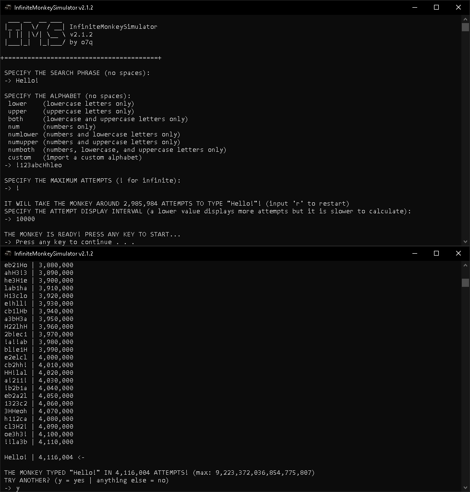

# [<b>>> Download Latest</b>](https://github.com/o7q/InfiniteMonkeyCalculator/releases/download/v1.0.0/InfiniteMonkeyCalculator.exe)
<h3>Simulate an immortal monkey typing on a typewriter.</h3>

---

---

# Overview
A super simple program I made in an hour. It allows you to simulate how many attempts it would take to get a desired string from random strings.

I made this for fun using the <b>Mersenne Twister</b> pseudorandom number generator: https://en.wikipedia.org/wiki/Mersenne_Twister

<b>InfiniteMonkeyCalculator</b> is based on the <b>Infinite Monkey Theorem</b>: https://en.wikipedia.org/wiki/Infinite_monkey_theorem

---

# Usage

## <b>Interface</b>
- <b>Search Phrase</b> Phrase you want to search for
- <b>Maximum Attempts</b> Maximum search attempts
- <b>Display Output</b> Should it output the strings (greatly slows down program)

---

<b>InfiniteMonkeyCalculator</b> \
Programmed with C++ and compiled using MinGW G++